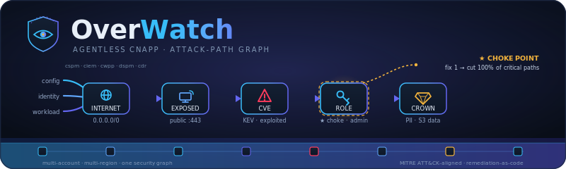

<p align="center">
  
</p>

<p align="center">
  <strong>Security scanners for AWS cloud environments -- live audit scripts and IaC static analysis</strong>
</p>

<p align="center">
  
  
  
  
  
</p>

---

## Overview

This repository contains **three complementary AWS security scanners**:

| Scanner | File | Type | Input | Checks |
|---------|------|------|-------|--------|
| **Base Audit Script** | `aws_security_audit_scripts.sh` | Live AWS API audit | Running AWS account | 20 across 8 sections |
| **Enhanced Audit Script** | `aws_security_audit_enhanced.sh` | Live AWS API audit | Running AWS account | 57 across 16 sections |
| **IaC Security Scanner** | `aws_scanner.py` | Static analysis | CloudFormation + Terraform files | 100+ (60 TF regex + 42 CF structural) |

Use the **audit scripts** to scan a live AWS account for CIS Benchmark compliance. Use the **IaC scanner** to catch misconfigurations in CloudFormation templates and Terraform files before deployment.

---

## IaC Security Scanner (Static Analysis)

### What It Does

The IaC scanner performs **pure static analysis** of AWS Infrastructure-as-Code files -- no AWS credentials required. It scans CloudFormation templates (YAML/JSON) and Terraform configuration files (.tf) for security misconfigurations mapped to the CIS AWS Benchmark and AWS Well-Architected Security Pillar.

- **No AWS credentials required** -- analyses files locally
- **100+ security checks** -- 60+ Terraform regex rules + 42 CloudFormation structural checks
- **25+ AWS services covered** -- S3, IAM, EC2, RDS, Lambda, CloudTrail, and more
- **3 output formats** -- coloured console, JSON, interactive HTML
- **Optional dependency** -- `pyyaml` for CloudFormation YAML files (JSON works without it)

### Quick Start (IaC Scanner)

```bash
# Scan a directory of IaC files
python aws_scanner.py /path/to/infra/

# Scan a single CloudFormation template
python aws_scanner.py template.yaml --html report.html

# Scan Terraform files with severity filter
python aws_scanner.py main.tf --json findings.json --severity HIGH

# Verbose mode
python aws_scanner.py /path/to/cf/ --verbose --severity MEDIUM
```

### CLI Reference (IaC Scanner)

```
usage: aws_scanner.py [-h] [--json FILE] [--html FILE]
                      [--severity {CRITICAL,HIGH,MEDIUM,LOW,INFO}]
                      [-v] [--version]
                      target

positional arguments:
  target                File or directory containing CloudFormation templates or Terraform files

options:
  --json FILE           Write JSON report to FILE
  --html FILE           Write HTML report to FILE
  --severity SEV        Only report findings at this severity or above
  -v, --verbose         Show files as they are scanned
  --version             Show scanner version
```

### Terraform SAST Rules (60+ Rules)

| Service | Rule IDs | Count | Key Checks |
|---------|----------|-------|------------|
| **S3** | AWS-S3-TF-001 to 006 | 6 | Public ACLs, Block Public Access settings |
| **IAM** | AWS-IAM-TF-001 to 004 | 4 | Wildcard actions/principals, password reset |
| **EC2/SG** | AWS-SG-TF-001 to 003, AWS-EC2-TF-001 to 003 | 6 | SSH/RDP from 0.0.0.0/0, IMDSv1, public IP, EBS encryption |
| **RDS** | AWS-RDS-TF-001 to 006 | 6 | Public access, encryption, backups, deletion protection, Multi-AZ |
| **CloudTrail** | AWS-CT-TF-001 to 003 | 3 | Log validation, multi-region, global events |
| **KMS** | AWS-KMS-TF-001 | 1 | Key rotation |
| **CloudFront** | AWS-CF-TF-001 to 002 | 2 | HTTPS enforcement, TLS version |
| **ElastiCache** | AWS-ECACHE-TF-001 to 002 | 2 | At-rest and in-transit encryption |
| **ECS** | AWS-ECS-TF-001 to 002 | 2 | Privileged mode, writable root filesystem |
| **OpenSearch** | AWS-OS-TF-001 to 002 | 2 | HTTPS enforcement, node-to-node encryption |
| **Redshift** | AWS-RS-TF-001 to 002 | 2 | Public access, encryption |
| **ECR** | AWS-ECR-TF-001 | 1 | Mutable image tags |
| **DynamoDB** | AWS-DDB-TF-001 | 1 | SSE encryption |
| **Lambda** | AWS-LAM-TF-001 | 1 | Reserved concurrency throttling |
| **API Gateway** | AWS-APIGW-TF-001 | 1 | Stage logging |
| **Credentials** | AWS-CRED-TF-001 to 002 | 2 | Hardcoded AWS keys, passwords |
| **CloudWatch** | AWS-CW-TF-001 to 003 | 3 | Log retention, KMS encryption, alarm actions |
| **VPC** | AWS-VPC-TF-001 to 002 | 2 | Flow logs, public subnet auto-assign |
| **WAF** | AWS-WAF-TF-001 | 1 | Default allow action |
| **GuardDuty** | AWS-GD-TF-001 | 1 | Detector disabled |
| **Config** | AWS-CFG-TF-001 to 002 | 2 | All resource types, global resources |
| **Elastic Beanstalk** | AWS-EB-TF-001 to 002 | 2 | HTTPS listener, managed updates |
| **SageMaker** | AWS-SM-TF-001 to 002 | 2 | Internet access, storage encryption |
| **EBS** | AWS-EBS-TF-001 | 1 | Volume encryption |
| **Step Functions** | AWS-SFN-TF-001 to 002 | 2 | Logging, X-Ray tracing |
| **Bedrock** | AWS-BR-TF-001 | 1 | Guardrails |

### CloudFormation Structural Checks (42 Resource Types)

| Service | Resource Types | Key Checks |
|---------|---------------|------------|
| **IAM** | Role, Policy, ManagedPolicy, User | Wildcard principal/action, AdministratorAccess, inline user policies |
| **S3** | Bucket | Public access block, versioning, encryption, logging |
| **EC2** | SecurityGroup, Instance | Open ports (22/3389/0-65535), IMDSv2, public IP |
| **RDS** | DBInstance, DBCluster | Public access, encryption, backups, deletion protection, Multi-AZ |
| **Lambda** | Function | Reserved concurrency, KMS encryption, tracing |
| **CloudTrail** | Trail | Log validation, multi-region, S3 encryption |
| **CloudFront** | Distribution | HTTPS, TLS 1.2+, WAF, logging, origin protocol |
| **ELB** | Listener | HTTPS protocol enforcement |
| **API Gateway** | Stage | Logging, stage variables |
| **KMS** | Key | Rotation enabled |
| **SQS** | Queue | KMS encryption |
| **SNS** | Topic | KMS encryption |
| **DynamoDB** | Table | Point-in-time recovery, SSE |
| **ElastiCache** | ReplicationGroup | Encryption (rest + transit), auth token |
| **EKS** | Cluster | Endpoint public access, logging, encryption |
| **ECS** | TaskDefinition | Privileged mode, read-only root, logging |
| **Cognito** | UserPool | MFA, password policy |
| **OpenSearch** | Domain | HTTPS, node-to-node encryption, encryption at rest |
| **Redshift** | Cluster | Public access, encryption, logging |
| **ECR** | Repository | Image tag mutability, scan on push |
| **Secrets Manager** | Secret | KMS encryption |
| **CloudWatch** | Alarm | Alarm actions |
| **Logs** | LogGroup | Retention, KMS encryption |
| **VPC/Subnet** | VPC, Subnet, FlowLog | Flow logs, public IP auto-assign |
| **WAFv2** | WebACL | Default action |
| **GuardDuty** | Detector | Enabled status |
| **Config** | ConfigurationRecorder | All supported types, global resources |
| **Elastic Beanstalk** | Environment | HTTPS, managed updates |
| **SageMaker** | NotebookInstance, Domain | Internet access, KMS encryption |
| **Bedrock** | Agent | Guardrails |
| **EBS** | Volume | Encryption |
| **Step Functions** | StateMachine | Logging, tracing |

---

## Live Audit Scripts (AWS API)

### What They Do

The audit scripts connect to a live AWS account via AWS CLI and boto3, performing **read-only** security checks aligned to the **CIS AWS Foundations Benchmark v3.0**. They produce colour-coded terminal output with PASS/FAIL/WARN verdicts and save evidence files to a timestamped output directory.

- **Read-only by design** -- never modifies AWS resources
- **57+ security checks** across 16 audit sections (enhanced script)
- **CIS Benchmark aligned** -- AWS Foundations Benchmark v3.0
- **Evidence collection** -- CSV/JSON files saved per check

### Prerequisites (Audit Scripts)

- **AWS CLI v2** -- configured with valid credentials (`aws configure` or IAM role)
- **Python 3.8+** with `boto3` installed (`pip install boto3`)
- **IAM permissions** -- the executing identity needs the `SecurityAudit` AWS-managed policy (read-only)
- **Default region** -- `eu-west-1`; override via `AWS_DEFAULT_REGION` environment variable

### Quick Start (Audit Scripts)

```bash
# Run the base audit (Sections 1-8, 20 checks)
bash aws_security_audit_scripts.sh

# Run the enhanced audit (Sections 1-16, 57 checks)
bash aws_security_audit_enhanced.sh

# Target a specific region
AWS_DEFAULT_REGION=us-east-1 bash aws_security_audit_enhanced.sh
```

Output is written to `aws_audit_<ACCOUNT_ID>_<YYYYMMDD_HHMMSS>/` in the current directory.

### Scripts at a Glance

| Script | Sections | Checks | Lines | Scope |
|--------|----------|--------|-------|-------|
| `aws_security_audit_scripts.sh` | 8 | 20 | ~420 | IAM, S3, VPC, Logging, KMS, EC2, ECR, Backup |
| `aws_security_audit_enhanced.sh` | 16 | 57 | ~1,434 | Everything above + RDS, Glacier, SNS, SQS, CloudFront, Route 53, Bedrock, Bedrock Agents |

### Security Checks Coverage

#### Sections 1-8 (both scripts)

| Section | Check IDs | Description |
|---------|-----------|-------------|
| **1: IAM** | IAM-01/02, IAM-04/05/06/10 | Root MFA + access keys, console users without MFA, password policy, stale access keys, IAM Access Analyzer |
| **2: S3** | S3-01, S3-03, S3-05 | Account-level Block Public Access, per-bucket public access + ACLs + encryption |
| **3: VPC / Network** | VPC-01, VPC-03 | Security groups with risky ports open to 0.0.0.0/0, VPC Flow Logs |
| **4: Logging & Monitoring** | LOG-01/03/04/05 | CloudTrail multi-region + validation, AWS Config, GuardDuty, Security Hub |
| **5: Encryption & KMS** | ENC-03 | KMS customer-managed key rotation |
| **6: Compute / EC2** | EC2-04/05/06 | IMDSv2, public IP, EBS volume encryption |
| **7: Containers** | CNT-01 | ECR scan-on-push |
| **8: Backup & DR** | BCK-01 | AWS Backup vaults and resource assignments |

#### Sections 9-16 (enhanced script only)

| Section | Check IDs | Description |
|---------|-----------|-------------|
| **9: RDS** | RDS-01 to 06 | Encryption, public access, backups, deletion protection, monitoring, public snapshots |
| **10: S3 Glacier** | GLC-01 to 03 | Vault access policies, vault lock (WORM), SNS notifications |
| **11: SNS** | SNS-01 to 04 | SSE-KMS encryption, wildcard principal, HTTPS delivery, cross-account subscriptions |
| **12: SQS** | SQS-01 to 04 | SSE encryption, public access, DLQ, retention/visibility |
| **13: CloudFront** | CFN-01 to 05 | HTTPS-only, TLS version, WAF, access logging, origin protocol |
| **14: Route 53** | R53-01 to 05 | Query logging, DNSSEC, transfer lock, health checks, DNS firewall |
| **15: Bedrock** | BDR-01 to 05 | Model logging, guardrails, KMS encryption, VPC endpoint, IAM least privilege |
| **16: Bedrock Agents** | AGT-01 to 05 | Agent KMS encryption, execution role, KB security, Lambda security, prompt injection |

---

## When to Use Which Scanner

| Scenario | Recommended Scanner |
|----------|-------------------|
| Pre-deployment IaC review (CloudFormation / Terraform) | **IaC Scanner** (`aws_scanner.py`) |
| Live AWS account security audit | **Audit Scripts** (`.sh`) |
| CI/CD pipeline gate for infrastructure code | **IaC Scanner** |
| Compliance assessment against CIS AWS Benchmark | **Audit Scripts** |
| No AWS credentials available, only code to review | **IaC Scanner** |
| Comprehensive audit of a production account | **Both** -- IaC Scanner on templates, Audit Scripts on live account |

---

## Project Structure

```
AWS-Security-Scanner/
├── aws_scanner.py                   # IaC Security Scanner (CloudFormation + Terraform)
├── aws_security_audit_scripts.sh    # Base audit script (8 sections, 20 checks)
├── aws_security_audit_enhanced.sh   # Enhanced audit script (16 sections, 57 checks)
├── docs/
│   └── banner.svg
├── LICENSE                          # GPL-3.0
└── README.md
```

---

## Requirements

| Scanner | Requirements |
|---------|-------------|
| IaC Scanner | Python 3.10+, optional `pyyaml` for CF YAML templates |
| Audit Scripts | Bash 5.0+, AWS CLI v2, Python 3.8+ with `boto3`, `SecurityAudit` IAM policy |

---

## Disclaimer

These tools are for **authorised security assessments only**. The audit scripts perform read-only API calls and never modify AWS resources. The IaC scanner performs pure static analysis with no AWS connectivity. Always ensure you have explicit authorisation before scanning.

---

## License

GPL-3.0 License -- see [LICENSE](LICENSE).
